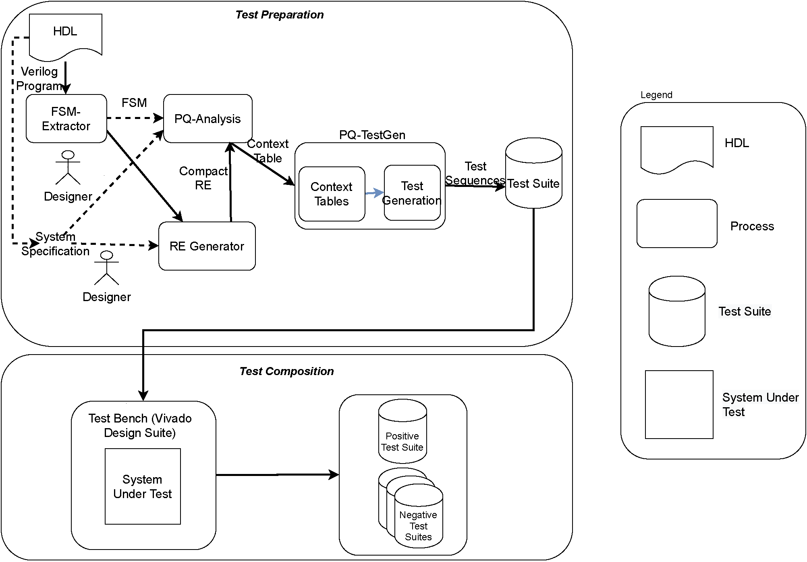
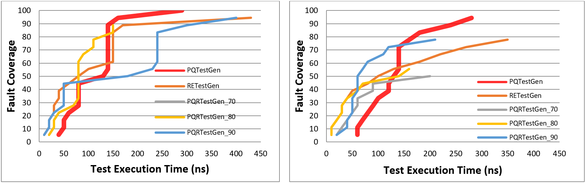
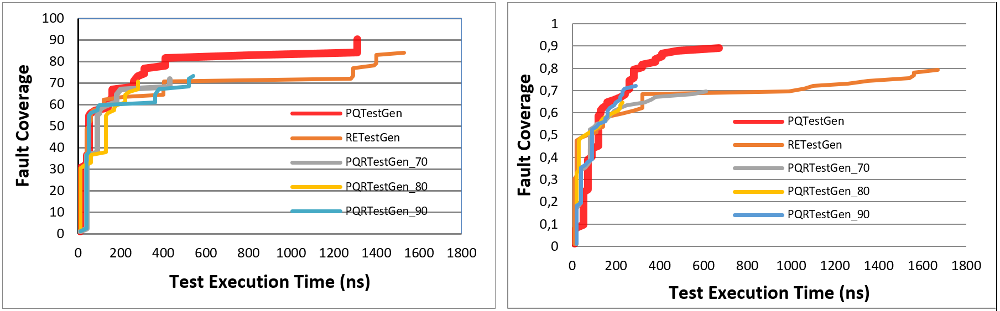

# Model-based Ideal Testing of HDL Programs

The bundle provides an ideal testing framework including tool supports for Hardware Description Language (HDL) programs. See Fig. 1 for general flow of MBIT for GUI programs. The framework combines the holistic and mutation testing to achieve ideal testing called Model-Based Ideal Test (MBIT).

<figure>

<figcaption>Fig.1 - The General Flow.</figcaption>

</figure>

[1.Test preparation](#1)

*   [1.1.Model construction(Manual)](#1.1)
*   [1.2.Model Mutation(Manual)](#1.2)
*   [1.3.Model Conversion(Automatic)](#1.3)
*   [1.4.Test Generation(Automatic)](#1.4)

[2.Test Composition](#2)

*   [2.1.Pre-selection(Automatic)](#2.1)
*   [2.2.Test Suite Construction(Automatic)](#2.2)

The rough details including tool supports will be explained as follows considering given steps.

## 1.Test preparation

It is the first step of the framework, which starts with construction of the model from HDL.
The HDL is modeled by means of a finite state machine(FSM) automatically using JFLAP or PQ-Analysis tool. The model constructed is called original
or fault-free FSM. Then, the mutants are generated from the original FSM by utilizing mutation operators that 
are specific to the FSM. Then, the models including mutants are converted to the regular expressions(REs) using
JFLAP tool or PQ-Analysis tool. At the final step of the test preparation, the test sequences are generated from
the corresponding RE models automatically using PQ-TestGen and PQ-RanTest tools.

**1.1** Model construction step requires expertise of the designer or tester who knows basics of the HDL. However, it can be
	directly constructed from the given specification of the HDL without expertise and extensive human effort using FSM-Extractor tool. In proposed
	framework, it is constructed from the HDL manually or automatically with knowledge of tester about the system. The JFLAP tool is preferred due to
	its easy to use interface for manual process. However, we develop an automation tool for extraction of model from HDL program, called FSM-Extractor.

#### Tool Support:

*   [1]JFLAP, available at [http://www.jflap.org/](http://www.jflap.org/)
*   [2]PQ-Analysis, avaliable at [http://download.ivknet.de/](http://download.ivknet.de/)

#### Example: (TBD):

**1.2** Model conversion step is carried out manually using JFLAP tool for original and each mutant models. This step can be also done using PQ-Analysis tool, which results in longer RE models due usage of different conversion algorithm than JFLAP tool.

#### Tool Support:

*   [1]JFLAP, available at [http://www.jflap.org/](http://www.jflap.org/)
*   [2]PQ-Analysis, avaliable at [http://download.ivknet.de/](http://download.ivknet.de/)

#### Example: (TBD):

**1.3** Model conversion step is carried out manually using JFLAP tool for original and each mutant models. This step can be also done using PQ-Analysis tool, which results in longer RE models due usage of different conversion algorithm than JFLAP tool.

#### Tool Support:

*   [1]JFLAP, available at [http://www.jflap.org/](http://www.jflap.org/)
*   [2]PQ-Analysis, avaliable at [http://download.ivknet.de/](http://download.ivknet.de/)

#### Example: (TBD)

**1.4** Test generation step is done using PQ-TestGen and PQ-RanTest tool which takes inputs from the PQ-Analysis results. Note than there is preliminary step between model conversion and test generation called analysis step that results in  context table, which represents the RE after analysis. The resulted tables are used in test generation algorithms.

#### Tool Support:

*   [1]PQ-Analysis, avaliable at [http://download.ivknet.de/](http://download.ivknet.de/)
*   [2]PQ-TestGen, download link for jar file
[Link](TestGen_v3.jar)

*   [3]PQ-RanTest, download link for jar file
[Link](TestGen_v3.jar)

*   [4]RE-TestGen, download link for jar file
[Link](ReT_v3.jar)

#### Example: (TBD)

## 2.Test Composition

In test composition step, the test sequences generated from original and mutant models are automatically executed on original and
	mutant HDL, which are depending on the positive and negative testing. In positive testing, the test sequences generated
	from original model are executed on mutant HDLs that are obtained from original HDL using mutation operators at code
	level. In negative testing, the test sequences generated from mutant models are executed on original HDL. These steps
	define test execution. In test selection, the failed test sequences from positive and negative testing for each execution
	are selected to achieve ideal test suite. To this end, the proposed framework satisfies requirements of the ideal
	testing in the scope of the model of HDL.

**2.1** Test pre-selection step is performed by Vivado Design Suite (Xilinx) for which we write a generic test bench in Verilog HDL. The test bench
		automatically reads the test sequences and execute them on the corresponding HDL.

#### Tool Support:

*   [1]Vivado Design Suite (Xilinx), avaliable at [https://www.xilinx.com/products/design-tools/vivado.html)
*   [2]TTest Bench, avaliable at, download link for Java file
[Link](tb_TLC.v)

**2.2** Test suite construction is also performed by means of test bench in which the failed test sequences executed on corresponding
		HDL are selected and written to file that is called ideal test suite for each models.

#### Tool Support:

*   [1]Vivado Design Suite (Xilinx), avaliable at [https://www.xilinx.com/products/design-tools/vivado.html)
*   [2]TTest Bench, avaliable at, download link for Java file
[Link](tb_TLC.v)

#### Results

Please see results for test execution for Sequence Detector, Traffic Light Controller, and RISC-V Processor in Table 1-3 and Figure 2-4 respectively.

<figure>

<figcaption>Table.1 - Test results for Sequence Detector</figcaption>

</figure>

<figure>

<figcaption>Table.2 - Test results for Traffic Light Controller</figcaption>

</figure>

<figure>

<figcaption>Table.3 - Test results for RISC-V Processor</figcaption>

</figure>

<figure>

<figcaption>Fig.2 - Test curves for Sequence Detector</figcaption>

</figure>

<figure>

<figcaption>Fig.3 - Test curves for Traffic Light Controller</figcaption>

</figure>

<figure>

<figcaption>Fig.4 - Test curves for RISC-V Processor</figcaption>

</figure>

Note: Please do not hesitate to contact Onur Kilincceker (onurkilincceker@gmail.com) for any problems and comments. This page is designed to explain Tool Support section of a paper submitted the a journal.
